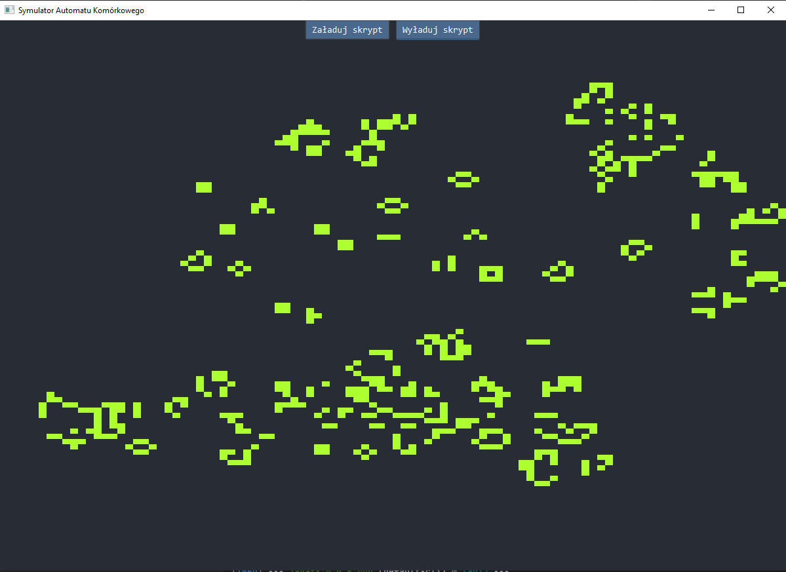
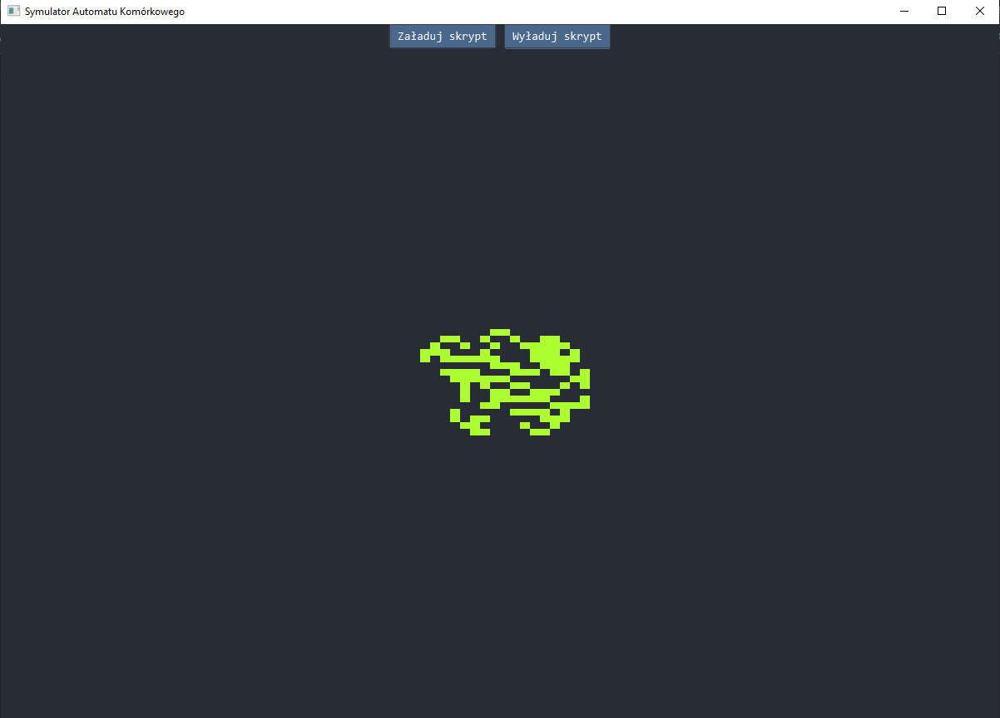
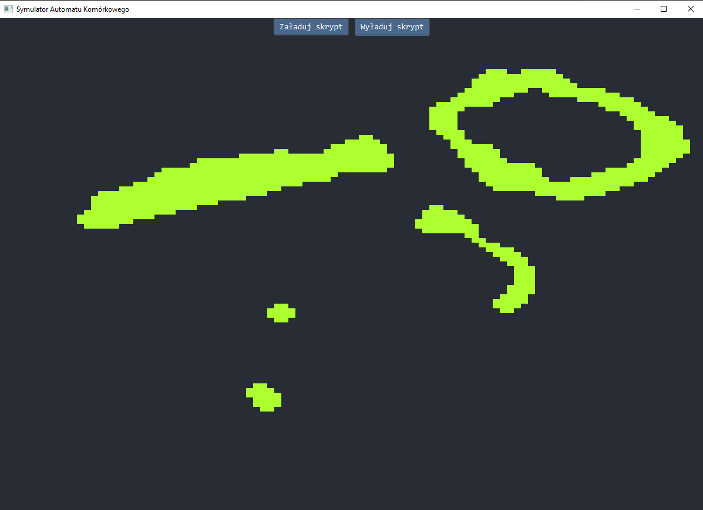

# Projekt: Automaty Komórkowe w Javie z JavaScript

## Opis projektu

Celem tego projektu było stworzenie aplikacji w języku Java, która pozwala na wizualizację działania automatów komórkowych. Logika tych automatów została zaimplementowana za pomocą dynamicznie ładowanych skryptów JavaScript. Projekt wykorzystuje JavaFX do interfejsu graficznego oraz Nashorn do interpretacji skryptów JavaScript.

## Konfiguracja projektu

### Maven

W pliku `pom.xml` dodaliśmy odpowiednie zależności i wtyczki, aby zintegrować JavaFX i Nashorn:

```xml
<dependencies>
    <dependency>
        <groupId>org.openjdk.nashorn</groupId>
        <artifactId>nashorn-core</artifactId>
        <version>15.4</version>
    </dependency>
    <dependency>
        <groupId>org.dynalang</groupId>
        <artifactId>dynalink</artifactId>
        <version>0.7</version>
    </dependency>
    <dependency>
        <groupId>org.openjfx</groupId>
        <artifactId>javafx-controls</artifactId>
        <version>22</version>
    </dependency>
    <dependency>
        <groupId>org.openjfx</groupId>
        <artifactId>javafx-fxml</artifactId>
        <version>22</version>
    </dependency>
</dependencies>
<build>
    <plugins>
        <plugin>
            <groupId>org.apache.maven.plugins</groupId>
            <artifactId>maven-compiler-plugin</artifactId>
            <version>3.13.0</version>
            <configuration>
                <release>17</release>
            </configuration>
        </plugin>
        <plugin>
            <groupId>org.openjfx</groupId>
            <artifactId>javafx-maven-plugin</artifactId>
            <version>0.0.8</version>
            <executions>
                <execution>
                    <id>default-cli</id>
                    <configuration>
                        <options>-Djavafx.allowjs=true --add-modules jdk.dynalink --add-reads jdk.dynalink=ALL-UNNAMED --add-reads java.base=ALL-UNNAMED -Dpolyglot.engine.WarnInterpreterOnly=false -Dpolyglot.js.nashorn-compat=true -Dfile.encoding=UTF-8</options>
                        <mainClass>pl.pwr.Main</mainClass>
                    </configuration>
                </execution>
            </executions>
        </plugin>
    </plugins>
</build>
```

### JavaFX

Główna klasa aplikacji JavaFX `Main` uruchamia aplikację i ładuje interfejs z pliku FXML:

```java
public class Main extends Application {
    @Override
    public void start(Stage primaryStage) throws Exception {
        FXMLLoader loader = new FXMLLoader(getClass().getResource("/pl/pwr/gui/layout.fxml"));
        VBox root = loader.load();
        Scene scene = new Scene(root, 1200, 1200);
        primaryStage.setTitle("Automat Komórkowy");
        primaryStage.setScene(scene);
        primaryStage.show();
    }

    public static void main(String[] args) {
        launch(args);
    }
}
```

### Kontroler

Kontroler zarządza interakcją z użytkownikiem oraz uruchamianiem skryptów:

```java
public class Controller {
    @FXML
    private Canvas canvas;
    @FXML
    private Button unloadButton;
    @FXML
    private Button loadButton;
    private final CellularMatrix grid = new CellularMatrix(100, 100);
    private Invocable evolveFunction = null;

    @FXML
    private void initialize() {
        startDrawing();
    }

    public void loadJavascript() {
        // Kod ładowania skryptów JavaScript
    }

    public void unloadJavascript() {
        // Kod wyładowywania skryptów i resetowania siatki
    }
}
```

### CellularMatrix

Klasa `CellularMatrix` przechowuje stan komórek i zapewnia metody do ich aktywacji i dezaktywacji:

```java
public class CellularMatrix {
    private final int width;
    private final int height;
    private final boolean[][] cells;

    public CellularMatrix(int width, int height) {
        this.width = width;
        this.height = height;
        this.cells = new boolean[width][height];
        initializeGrid();
    }

    private void initializeGrid() {
        for (int x = 0; x < width; x++) {
            for (int y = 0; y < height; y++) {
                cells[x][y] = false;
            }
        }
    }

    public void activateCell(int x, int y) {
        validateCoordinates(x, y);
        cells[x][y] = true;
    }

    public void deactivateCell(int x, int y) {
        validateCoordinates(x, y);
        cells[x][y] = false;
    }

    private void validateCoordinates(int x, int y) {
        if (x < 0 || x >= width || y < 0 || y >= height) {
            throw new IllegalArgumentException("Coordinates out of bounds: (" + x + ", " + y + ")");
        }
    }
}
```

### Skrypty JavaScript

W projekcie znajdują się trzy skrypty JavaScript implementujące różne automaty komórkowe:

1. **gameOfLife.js** - implementacja gry w życie
2. **langtonAnt.js** - implementacja mrówki Langtona
3. **majorityState.js** - implementacja automatu z większościowym stanem

### Wyniki działania

Poniżej znajdują się zrzuty ekranu z wynikami działania programu:

#### gameOfLife.js


#### langtonAnt.js


#### majorityState.js


## Instrukcja uruchomienia

1. Sklonuj repozytorium i przejdź do katalogu projektu.
2. Uruchom komendę `mvn clean javafx:run`, aby zbudować i uruchomić aplikację.
3. W aplikacji, użyj przycisków "Załaduj skrypt" i "Wyładuj skrypt", aby dynamicznie ładować i wyładowywać skrypty JavaScript.

## Zakończenie

Ten projekt demonstruje, jak można używać JavaFX do tworzenia interfejsu graficznego i Nashorn do interpretacji dynamicznie ładowanych skryptów JavaScript, aby rozszerzyć funkcjonalność aplikacji Java.

---